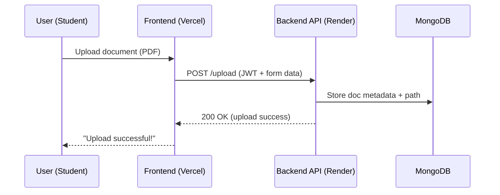
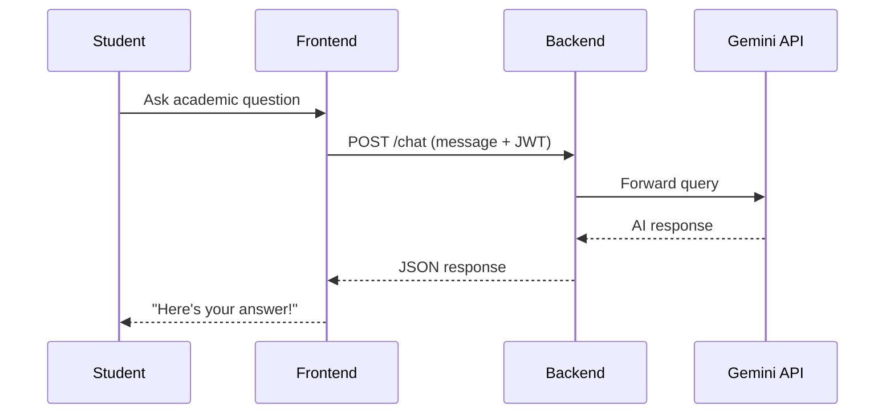

# 📂 Convocation Portal

*A Smart Academic Collaboration & Document Management Platform*

> A modern, full-stack web application designed to streamline communication between **students** and **faculty**. Built with a clean UI, role-specific workflows, and powered by an integrated **Gemini AI chatbot** for seamless academic assistance.

---

## 🌐 Live Demo

🔗 **Live URL**: [https://convocation-portal123-6ed1.vercel.app](https://convocation-portal123-6ed1.vercel.app)
🖥️ **Frontend Hosted on**: Vercel
🔧 **Backend Hosted on**: Render

---

## 🚀 Project Overview

**Convo Portal** is a secure, responsive academic platform that enables:

* 📁 Document uploads and version tracking
* 👥 Role-based dashboards (Student / Faculty)
* 🔍 File access history and logs
* 🧠 Gemini AI Chatbot for instant academic assistance
* 🐳 Docker-ready architecture

---

## 🛠️ Tech Stack

### 🖥️ Frontend

* React.js + Vite
* Tailwind CSS
* Axios
* React Router DOM

### 🔧 Backend

* Node.js
* Express.js
* Docker
* MongoDB (Mongoose ODM)

### 🧠 AI Integration

* Gemini API (Google AI)

### 🧰 DevOps & Tools

* Git & GitHub
* Postman
* Docker
* Vercel & Render

---

## ✨ Key Features

| Role                      | Functionality                                                                                                                           |
| ------------------------- | --------------------------------------------------------------------------------------------------------------------------------------- |
| 👩‍🎓 Student             | - Secure Register/Login <br> - Upload documents (PDFs, assignments) <br> - View upload history and status <br> - Personalized dashboard |
| 👨‍🏫 Faculty             | - View and manage all student uploads <br> - Download & track documents <br> - Organized submission dashboard                           |
| 🔐 Authentication         | - Role-based session management <br> - Secure form validation and error handling                                                        |
| 🧠 Gemini Chatbot         | - Instant academic query resolution <br> - Help with uploads, deadlines, dashboard navigation, etc.                                     |
| 🐳 Docker Support *(WIP)* | - Dockerfile and docker-compose setup for containerized deployment                                                                      |
| 💾 MongoDB                | - Stores user profiles, documents, and metadata securely                                                                                |

---

## 📌 Planned Enhancements

* 🔍 Document search & filters
* 📧 Email notifications on new uploads
* 🔔 In-app alerts and messaging
* 📊 Analytics dashboard for faculty
* 🛡️ Enhanced RBAC (role-based access control) using Express middleware
* 📦 Complete Docker & CI/CD integration

---

## 🧪 Local Development Setup

### Backend

```bash
cd backend
npm install
node server.js
```

### 🎨 Frontend Setup

```bash
cd my-vite-project
npm install
npm run dev
```

---

## 📊 System Design & Architecture

### 🧱 High-Level Architecture Diagram

```mermaid
graph TD
  C[Client (Student/Faculty)] -->|HTTP Requests| V[Vercel (Frontend - React/Vite)]
  V -->|API Calls| R[Render (Backend - Node/Express)]
  R -->|Document Data| M[MongoDB Atlas]
  R -->|Payment Request| P[Razorpay API]
  R -->|AI Query| G[Gemini AI API]

  C -- Upload/View Docs --> V
  V -- Auth Token --> R
```

---

### ⟳ API Flow – Document Upload



---

### 🧠 Gemini AI Chatbot Flow



---

> 📌 *Architecture diagrams and API flows are generated using Mermaid.js and reflect real deployment and traffic flow.*

---

**Made with ❤️ by Anika Sharma**
